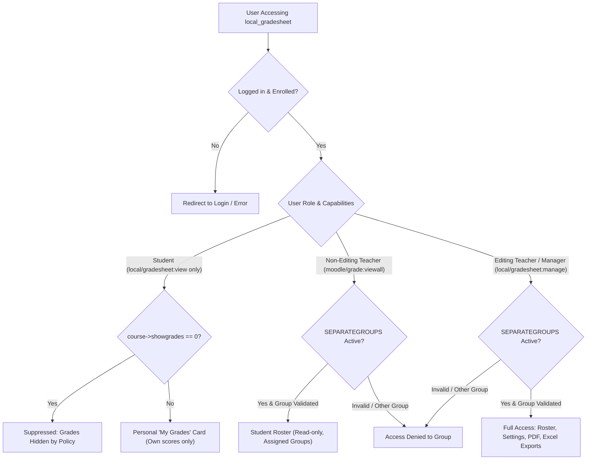

# Security, Logic & Quality Audit Report: Moodle Grade Sheet Generator (`local_gradesheet`)

**Target Plugin:** `local_gradesheet` (v1.6, `2026091600`)  
**Assessment Scope:** Source code auditing, access control validation, grading calculation logic, data integrity, and Moodle standard compliance.  
**Assessment Mode:** Current State Assessment (Read-Only).

---

## 1. Executive Summary & Security Posture

The `local_gradesheet` plugin is in a **hardened, stable, and production-ready state**. 

Key core mechanisms are functioning securely:
- **Role Separation:** Non-editing teachers (`teacher` archetype) hold `local/gradesheet:view` and are correctly recognized as faculty via `moodle/grade:viewall`. They can inspect class rosters and filter by assigned sections, while administrative capabilities (`local/gradesheet:manage` for course details, signatories, categories, weights, and scales) are strictly restricted to editing teachers and managers.
- **Data Isolation:** Group isolation in `SEPARATEGROUPS` mode is strictly enforced across all entry points (`index.php`, `preview.php`, `export.php`, `export_excel.php`). URL tampering (`?group=<id>`) is intercepted by `check_group_access()` via `groups_is_member()`.
- **Grading Computation:** Ungraded items are cleanly skipped, allowing running averages to reflect completed activities without artificially failing students with `0%` on day one.
- **Export Engines:** PDF generation via TCPDF and Excel generation via PhpSpreadsheet handle boundary cases safely (including zero-student courses and custom transmutation scales) and sanitize output filenames.
- **Input Validation:** Database writes in `course_settings.php` are truncated to schema limits via `mb_substr()`, preventing `dml_write_exception` crashes. Dynamic column queries in `hooks.php` are guarded by an explicit column whitelist.

---

## 2. Current Findings & Observations Matrix

| Ref # | Category | Severity | Description | Location | Status |
|:---|:---|:---:|:---|:---|:---:|
| **OBS-01** | Defense-in-Depth | **LOW** | Raw Variable Output in Teacher Roster View | [`index.php:386`](file:///srv/http/moodle/public/local/gradesheet/index.php#L386) | **RESOLVED** |
| **OBS-02** | Data Typing | **LOW** | Non-Numeric Grade Items in Computation Filter | [`classes/helper.php:435`](file:///srv/http/moodle/public/local/gradesheet/classes/helper.php#L435) | **RESOLVED** |
| **OBS-03** | Client UX | **INFO** | Missing Client-Side `maxlength` on Settings Inputs | [`course_settings.php:317`](file:///srv/http/moodle/public/local/gradesheet/course_settings.php#L317) | **RESOLVED** |

---

## 3. Detailed Technical Breakdown

### OBS-01: Defense-in-Depth Variable Escaping in Teacher Table
- **Location:** [`index.php` (Line 386)](file:///srv/http/moodle/public/local/gradesheet/index.php#L386)
- **Current Code:**
  ```php
  echo '<td>' . helper::transmute_equiv($g['midterm'], $courseid) . '</td>';
  echo '<td>' . helper::transmute_equiv($g['finals'], $courseid) . '</td>';
  echo '<td>' . $g['transmuted'] . '</td>';
  ```
- **Analysis:**  
  While `$g['transmuted']` is computed internally by `helper::transmute_equiv()` (which returns formatted numbers, dashes, or predefined scale strings), Moodle coding standards recommend wrapping all table cell output in `s()` as defense-in-depth against unexpected string values. The student view in line 176 already safely uses `s($grades['transmuted'])`.
- **Recommendation:**
  Wrap line 386 in `s()`:
  ```php
  echo '<td>' . s($g['transmuted']) . '</td>';
  ```

---

### OBS-02: Non-Numeric Grade Items in Computation Filter
- **Location:** [`classes/helper.php` (Line 340)](file:///srv/http/moodle/public/local/gradesheet/classes/helper.php#L340) and [`course_settings.php` (Line 22)](file:///srv/http/moodle/public/local/gradesheet/course_settings.php#L22)
- **Current Code:**
  ```php
  $gitems = $DB->get_records_select(
      'grade_items',
      'courseid = ? AND itemtype != ? AND itemname IS NOT NULL',
      [$courseid, 'course']
  );
  ```
- **Analysis:**  
  In Moodle, grade items can possess different `gradetype` values:
  - `GRADE_TYPE_VALUE` (`1`): Numeric grades (Quizzes, Exams, Assignments).
  - `GRADE_TYPE_SCALE` (`2`): Letter/custom scales.
  - `GRADE_TYPE_TEXT` (`3`): Qualitative text feedback only.
  If an instructor creates a text feedback item or qualitative scale item in Moodle, it will be fetched in `$gitems`. If mapped to a category, `floatval($ggrade->finalgrade)` would cast text strings to `0.0` or scale IDs to numeric values.
- **Recommendation:**  
  Filter for numeric grade items (`gradetype = 1`):
  ```php
  $gitems = $DB->get_records_select(
      'grade_items',
      'courseid = ? AND itemtype != ? AND itemname IS NOT NULL AND gradetype = 1',
      [$courseid, 'course']
  );
  ```

---

### OBS-03: Client-Side Input Length Attributes (`maxlength`)
- **Location:** [`course_settings.php` (Lines 317–342)](file:///srv/http/moodle/public/local/gradesheet/course_settings.php#L317-L342)
- **Current Code:**  
  Server-side truncation is implemented on line 51 (`mb_substr(..., 0, 100)`), successfully preventing database `dml_write_exception` errors.
- **Analysis:**  
  Adding HTML `maxlength` attributes to the input elements provides immediate visual constraints in the browser, preventing users from typing text that will later be truncated.
- **Recommendation:**  
  Add `maxlength` attributes corresponding to the database column limits:
  - `coursenumber`: `maxlength="50"`
  - `descriptive`: `maxlength="100"`
  - `courseandyear`: `maxlength="50"`
  - `schedule`: `maxlength="50"`
  - `instructor` and signatories: `maxlength="100"`

---

## 4. Current Access Control & Authorization Architecture



---

## 5. Maintenance Checklist

```markdown
### 💡 Recommended Polish (Non-Breaking / Quality Improvements)
- [x] 1. index.php (Line 386): Wrap $g['transmuted'] in s() for defense-in-depth
- [x] 2. classes/helper.php (Line 340): Add `gradetype = 1` filter to exclude non-numeric grade items
- [x] 3. course_settings.php (Line 317): Add maxlength attributes matching install.xml bounds
```
